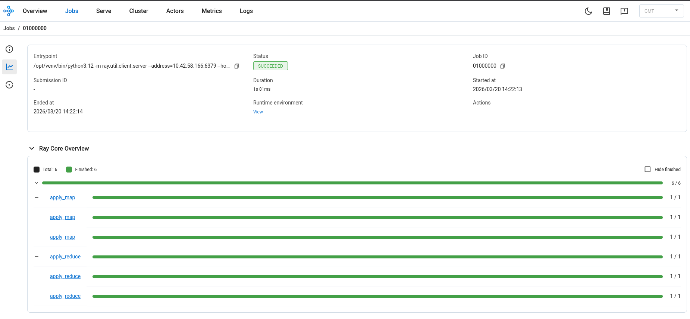
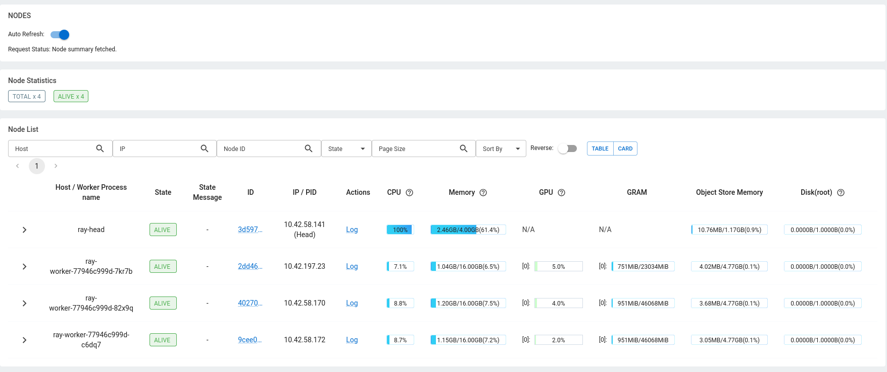
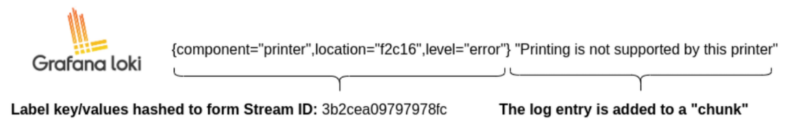
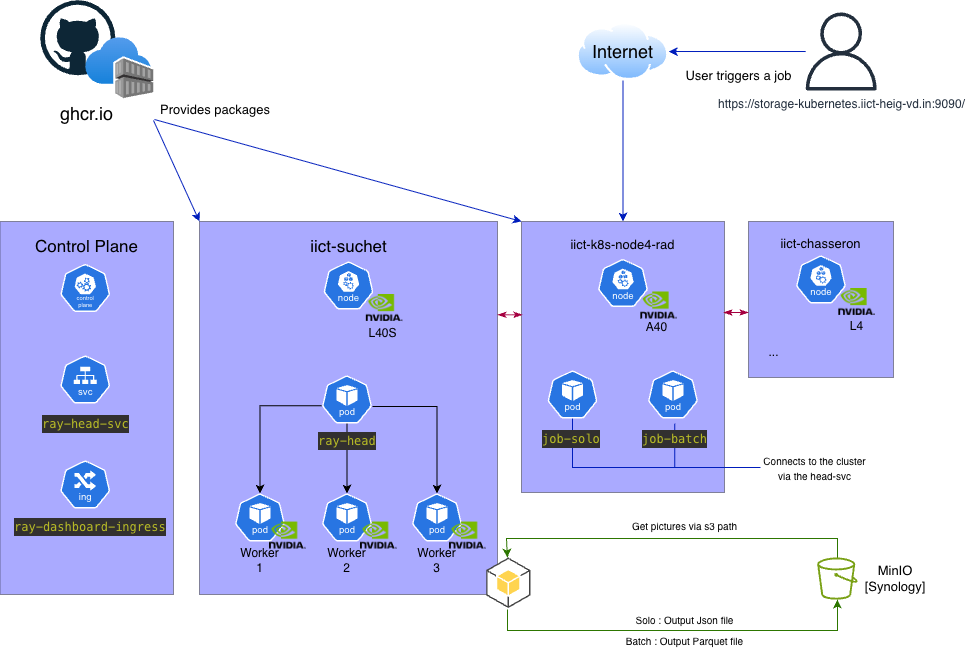
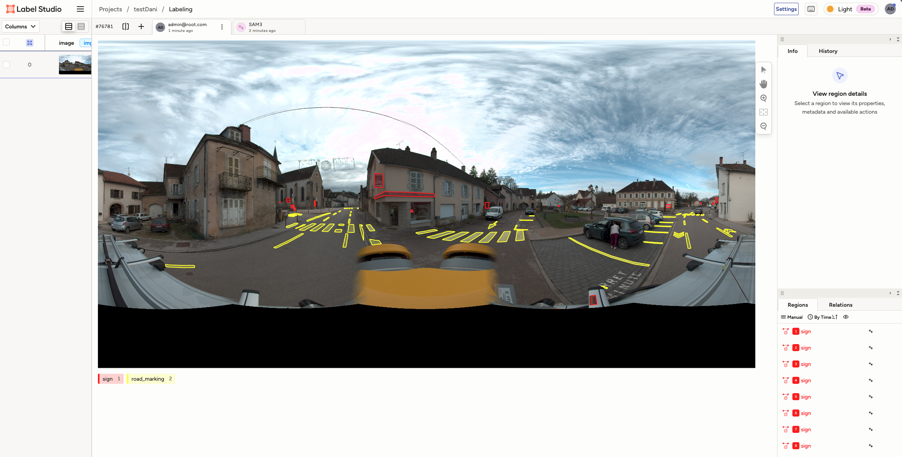
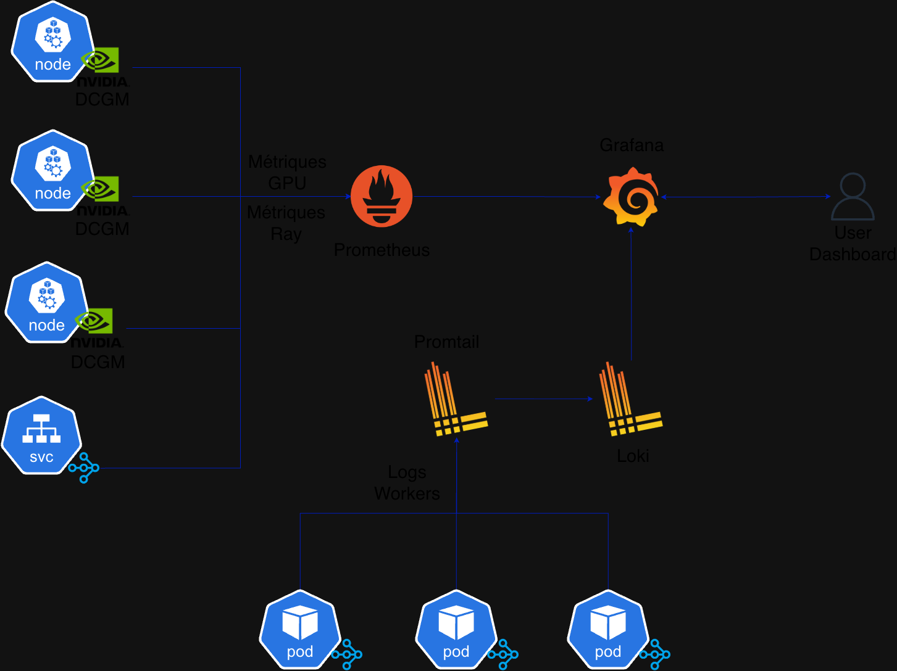

# Week 1

## K8s
- 4x GPUs available for compute
- Ray runs on HEIG's K8s cluster

## Storage
- Data stored on HEIG's S3 local buckets
- Label Studio data stored as JSON files, pictures stored on MinIO in the NearAI folder

## AI
- SAM3 (Meta) : segmentation model

## Data
- Downsampling: reduce image size, use polygons instead of hand-drawn labels
- Label Studio handles annotation, MinIO handles image storage

---

# Week 2

## Completed
- S3 alternatives to MinIO
- Spark vs Ray vs ZARR
- Read 3 redaction documents
- PostGIS
- HEIG cluster overview

## S3

S3 is a protocol, not a single product.

### CEPH
Mature open-source storage (LGPL). Supports block, file, and object (S3). Complex to set up. Relevant if a CEPH cluster already exists.

### RustFS
Similar to MinIO, Apache 2.0 license. S3-only focus. Streamlined migration from MinIO or CEPH. Project is young (<1 year) but already 22k stars on GitHub.

## Image Processing

### Ray
Parallelizes Python workloads across CPUs and GPUs. Better suited than Spark for AI inference: Spark targets structured data (Hadoop heritage), Ray targets GPU-heavy ML tasks with PyTorch.

### ZARR
N-dimensional array format. Reads data by chunks (tiles) instead of loading the full image. Efficient with Ray: workers read only needed tiles.

```
[PNG/TIFF sources]
       ↓
  ZARR conversion (one-time pre-processing)
       ↓
  Storage on S3
       ↓
  Ray workers → read chunks → run SAM3 → write labels
```

### MPS (Multi-Process Service)
NVIDIA feature allowing multiple CUDA processes to share one GPU. The HEIG-VD cluster uses MPS on node4 (2x A40, each split into 2 logical GPUs).

### PostGIS
PostgreSQL extension for geospatial data:

```sql
CREATE TABLE annotations (
    geom GEOMETRY(POLYGON, 4326)  -- SRID 4326 = WGS84
);
CREATE INDEX ON annotations USING GIST(geom);
```

Supports `POINT`, `POLYGON`, `MULTIPOLYGON`. GIST index enables fast spatial queries.

**Decision: dropped in favour of Parquet on S3.**

---

# Week 3

## Meeting notes
- MinIO runs on a Synology NAS → evaluate migration to RustFS
- Add observability and logging to the pipeline
- Plan a user entry point (interface or API)
- Focus on data: batch approach first

## Scenarios

### Scenario A Batch
- User provides ~2000 images
- SAM3 runs in batch via Ray
- Results stored as Parquet on S3
- No database required
- Reference: https://docs.ray.io/en/latest/data/data.htmlT folder (copy of templat

### Scenario B On-demand
- User submits one image → near-real-time response
- Pipeline triggered on the fly
- Results stored on S3

## Open questions
- Is a database necessary, or does Parquet on S3 cover both scenarios?
- Final output format for annotations?

---

# Week 4

## K8s commands

```bash
# Merge kubeconfig files
KUBECONFIG=conf.yaml:iict-rad.yaml kubectl config view --flatten > config-finale.yaml

# Start k9s on a specific context
k9s --context=iict-rad

# List pods in namespace dani
kubectl get pods -n dani --context=iict-rad
```

## Synology NAS

- Capacity: 45/80 TB used
- Network: 1 Gb/s
- Hardware: Synology SA3200D (2 controllers, HA)
- CPU/RAM usage: low

**Decision: keep MinIO.** Migration adds risk and delay. The pipeline builds on S3 swapping storage later means changing only the endpoint config.

MinIO on Synology is installed via Container Manager. Base image: `minio/minio`. To confirm with Mehdi.

## Tasks
- Build base structure, add bonus tasks after
- Both scenarios A and B, plus an observability/metrics layer
- Use Ray libraries to write results as Parquet
- Reference: [Google MapReduce paper](https://static.googleusercontent.com/media/research.google.com/en//archive/mapreduce-osdi04.pdf)

## Ray & Anyscale

Ray is an open-source Python framework for distributing AI/ML workloads across CPUs and GPUs.
Anyscale is the commercial platform built by the Ray founders managed, production-ready Ray.

### Ray primitives

```python
# @ray.remote : declares the function as executable on a worker
# .remote()   : submits the task (non-blocking)
# ray.get()   : waits for and retrieves results

@ray.remote
def apply_reduce(*buckets):
    counts = {}
    for bucket in buckets:
        for word, count in bucket:
            counts[word] = counts.get(word, 0) + count
    return counts

reduce_results = [
    apply_reduce.remote(*[map_results[m][p] for m in range(NUM_PARTITIONS)])
    for p in range(NUM_PARTITIONS)
]
```

### Ray Actor

Use an Actor when a model must be loaded once and reused across many tasks. Loading a model per task causes OOM.

```python
@ray.remote(num_gpus=1)
class Classifier:
    def __init__(self):
        self.model = load_model()  # loaded once

    def classify(self, image):
        return self.model(image)   # called N times
```

### RayCluster on K8s

KubeRay (`rayclusters.ray.io`) is the proper operator. Access requires a `RoleBinding` on API group `ray.io`. Request sent to IICT admin.

**Temporary workaround:** 1 head pod + 3 worker pods (Deployment).

### Ray connection

| Method | Result |
|---|---|
| `ray.init(address="host:6379")` | Pod becomes worker → crashes (no local raylet) |
| `ray.init("ray://host:10001")` | Correct: Ray Client protocol |

`--ray-client-server-port=10001` must be set in the head `ray start` command.

### Exposing ports Ingress

Per IICT documentation, services are exposed via Ingress (wildcard `*.iict-rad.iict-heig-vd.in`):

```yaml
apiVersion: networking.k8s.io/v1
kind: Ingress
metadata:
  name: ray-dashboard-ingress
  namespace: dani
spec:
  rules:
    - host: ray-dashboard.iict-rad.iict-heig-vd.in
      http:
        paths:
          - path: /
            pathType: Prefix
            backend:
              service:
                name: ray-head-svc
                port:
                  number: 8265
```

## Results

### Wordcount
Tasks distributed across all 3 workers and completed correctly.



### Dog classifier 5000 images (EfficientNet B0 on Stanford Dogs)

```
[4600/5000] traités
[4700/5000] traités
[4800/5000] traités
[4900/5000] traités
[5000/5000] traités

Top 10 premières images :
  Image 01 : Doberman                      (87.21%)
  Image 02 : African hunting dog           (83.32%)
  Image 03 : pug                           (55.45%)
  Image 04 : Weimaraner                    (82.86%)
  Image 05 : Mexican hairless              (75.63%)
  Image 06 : flat-coated retriever         (92.52%)
  Image 07 : dhole                         (97.87%)
  Image 08 : Shetland sheepdog             (80.94%)
  Image 09 : briard                        (71.99%)
  Image 10 : West Highland white terrier   (91.55%)

[SUCCES] 5000 images classifiées.
```



## Week 5


### Parquet

Parquet is a binary columnar file format designed for analytical workloads on large datasets. Unlike a relational database, there is no loading phase, files are queried directly from the data lake (MinIO in our case).

**Internal structure:**

```
Parquet file
└── Row Group 1          < horizontal split of rows
│   ├── Column Chunk A   < all values for column A in this group
│   │   ├── Page 1
│   │   └── Page 2
│   └── Column Chunk B
└── Row Group 2
    └── ...
```

Each column chunk is stored and compressed independently. This means reading only the columns you need. For exemple filtering polygons by confidence score without loading GPS coordinates.

Workers write results in parallel. each Ray worker produces one or more row groups. Queries on the output (filter by GPS zone, score threshold) only scan relevant columns. No database to maintain all our files sit on MinIO, PyArrow reads them directly.

Parquet stores min/max statistics per column chunk. A query engine can skip entire row groups without reading them if the predicate falls outside the range. This is called **predicate pushdown** and is supported natively by PyArrow and DuckDB.

Reference: Alice Rey, *Bridging the Gap between Data Lakes and RDBMSs*, EDBT/ICDT Workshop 2024.

### Promtail

Promtail is the log shipping agent for Loki. It runs as a DaemonSet (one instance per K8s node) and collects logs from all pods running on that node.

Promtail discovers pods via the K8s API (service discovery) then it reads log files from `/var/log/pods/` on the node si it cab attaches labels extracted from pod metadata: `namespace`, `pod`, `container`. Finnaly it ships log streams to Loki's Distributor via POST.

```
K8s Node
|-- ray-worker-0  |
|-- ray-worker-1  |──> Promtail ──> Loki Distributor ──> Ingester ──<> MinIO
|-- ray-worker-2  |
```

Each log line reaches Loki with labels like:

```
{namespace="dani", pod="ray-worker-abc", container="ray-worker"}
```

In our pipeline, Promtail captures stdout/stderr from Ray workers automatically. No code change required and the workers just print to stdout and Promtail picks it up.

### DCGM Exporter

It's simply a tool to export GPUs metrics. Which is very important in our case to monitor our pipeline. Protheus will scrap them via his HTTP endpoint then Grafana will simply read them.

```
K8s Node
|-- GPU A1  |
|-- GPU A2  |──> Prometheus ──> Grafana
|-- GPU A3  |
```

---

# Week 6

## SAM3 Pipeline : Benchmark

All runs on a single image (4096×8192 px, 2.8 MB JPEG), 3 Ray workers on L40S and A40.

### Run A : 512×512 tiles

| Metric | Value |
|--------|-------|
| Tiles | 128 |
| Workers | 3 (2× L40S on suchet, 1× A40 on node4) |
| Worker init (cold) | ~71s |
| Worker init (cached) | ~19s |
| Inference time/tile : L40S | ~2.0s |
| Inference time/tile : A40 | ~2.5s |
| Inference time/tile : avg | 2.00s |
| Total inference | 111.4s |
| Polygons extracted | 146 |
| **Total wall time** | **~1m50s** |

### Run B : 1024×1024 tiles

| Metric | Value |
|--------|-------|
| Tiles | 32 |
| Workers | 3 (2× L40S on suchet, 1× A40 on node4) |
| Inference time/tile : L40S | ~6.4s |
| Inference time/tile : A40 | ~9.3s |
| Inference time/tile : avg | 7.41s |
| Total inference | 103.3s |
| Polygons extracted | 49 |
| **Total wall time** | **~1m43s** |

### Analysis

Larger tiles yield no meaningful time reduction (~8s gain) but cut polygon count by 3x. The total inference time is dominated by SAM3 itself, not by tile count. 512×512 tiles are retained for better segmentation quality.

The L40S/A40 gap is visible: L40S processes a 1024-tile in 6.4s vs 9.3s on A40, a 1.45× ratio consistent with their FP16 tensor performance difference.

At 3 workers and ~111s per image, processing 2000 images would take ~62 hours and 1000 of them will do more than a day.

### GPU scheduling constraints

The HEIG-VD cluster exposes 9 GPUs across three nodes:

| Node | GPUs | Model | VRAM |
|------|------|-------|------|
| iict-suchet | 3 | NVIDIA L40S | 46 GB |
| iict-k8s-node4-rad | 2 | NVIDIA A40 | 46 GB |
| iict-chasseron | 4 | NVIDIA L4 | 23 GB |

During testing, only 3 workers could be scheduled (2 on suchet, 1 on node4). The remaining GPUs were occupied by other namespaces... The scheduler reported `Insufficient nvidia.com/gpu` on suchet and node4 for additional workers.

Chasseron was excluded for two reasons.
- First, its L4 GPUs offer lower compute than L40S and A40.
- Second, the node carried a `node.kubernetes.io/disk-pressure` taint during testing, which prevents pod scheduling and would have caused SIGTERM evictions at runtime.

The disk-pressure taint is applied automatically by K8s when a node's disk usage crosses a threshold. Any workload scheduled on such a node risks eviction without warning. The pipeline must treat this taint as a hard exclusion.

The `nodeAffinity` on worker pods targets L40S and A40 exclusively. The job driver pod doesn't requires GPU and runs without affinity constraints, relying on K8s to place it on a healthy node.


### Conclusion

Two paths exist to bring the batch duration under 24 hours.

The first is downsampling: reducing image resolution before tiling cuts tile count and inference time proportionally, at the cost of segmentation detail. This is acceptable if the target annotations do not require sub-pixel precision.

The second is accepting 1024x1024 tiles. With 32 tiles per image and ~7.4s per tile across 3 workers, inference per image drops to ~80s. At 2000 images that gives 44 hours : still over a day, but the polygon count drops from 146 to 49 per image, which reduces storage and Label Studio import volume.

The preferred approach is downsampling combined with 512×512 tiles. It preserves segmentation quality and keeps the pipeline architecture unchanged.

---

# Week 7

## Downsampling

Downsampling reduces image resolution before tiling. A scale factor of 0.5 halves both width and height, reducing tile count by 4× and inference time proportionally. The trade-off is segmentation detail: smaller input means SAM3 sees less edge information per tile.

Three scale factors were tested locally (Proxmox, GTX 970) at fixed tile size 512×512:

| Scale | Tiles (4096×8192 image) | Relative inference time |
|-------|------------------------|-------------------------|
| 1.0 (baseline) | 128 | 1.0× |
| 0.75 | 72 | ~0.56× |
| 0.5 | 32 | ~0.25× |
| 0.25 | 8 | ~0.06× |

Scale 0.5 is retained as the default. It cuts inference time by ~4× while preserving enough detail for the target annotation quality. Scale 0.25 is too aggressive: SAM3 loses fine contours on objects smaller than ~50px in the downsampled image.

---

# Week 8

### Loki

Loki is a log aggregation system that only indexes metadata labels, not the full log content. This makes it lightweight compared to Elasticsearch which is useful in our case because we don't need full-text search, we need to find logs from a specific Ray worker pod at a specific time.

It stores data in S3 format. Loki has 2 main storage types: index and chunks.

- **Index**: table of contents, maps label sets to chunk locations.
- **Chunks**: compressed blocks of raw log lines for a given label set and time range.



Logs are queried with **LogQL**, a label-based query language:

```logql
{namespace="dani", pod=~"ray-worker.*"} |= "ERROR"
```

In our pipeline, Promtail runs as a DaemonSet and ships all pod logs to Loki. Loki stores them on MinIO woth no extra storage infrastructure needed. Grafana queries Loki alongside Prometheus, which allows correlating a GPU spike on a graph with the corresponding worker logs.

---

# Week 9

## Architecture Diagram



## K8s vs RayCluster

Kubernetes and RayCluster use overlapping but distinct terminology. A K8s Service exposes pods via a stable DNS name and load-balances across them. A RayCluster head node is exposed as a K8s Service, but Ray has its own internal GCS (Global Control Store) address that workers connect to not the K8s service port directly.

| Term | K8s meaning | Ray meaning |
|------|-------------|-------------|
| Head | N/A | Single node running GCS, scheduler, dashboard |
| Worker | Pod in a Deployment | Ray node registered with GCS, executes tasks |
| Service | Stable ClusterIP for pod selection | Exposes GCS (6379), dashboard (8265), client (10001) |
| Namespace | Logical cluster isolation | Shared across all Ray nodes in a cluster |

Ray workers do not connect to a K8s Service they connect to the GCS address published by the head node on startup. The Ray Client (external driver) connects via `ray://host:10001`.

## GPU Operator

The NVIDIA GPU Operator automates the installation of GPU drivers, the device plugin, and DCGM Exporter on each node. Without it, pods requesting `nvidia.com/gpu` resources will not be scheduled.

Confirmed via IICT wiki : the GPU Operator is installed on the iict-rad cluster (K8s 1.32.5). GPUs are shared across namespaces using MPS (Multi-Process Service). No action needed `nvidia.com/gpu` resource requests work out of the box.

Reference: https://docs.nvidia.com/datacenter/cloud-native/gpu-operator/latest/overview.html

## SAM3 Performance Reference

Rémy reported that Shancli's optimised SAM3 backend processed the Neuchâtel dataset (~11 000 images) in 7–8 hours.

| Pipeline | Time/image | Total (11k images) |
|----------|-----------|---------------------|
| Shancli (optimised) | ~2.5s | ~7.5h |
| Ours (3 workers, 512×512 tiles) | ~111s | ~340h |

The 44× gap suggests Shancli's image likely has the model pre-loaded and optimised (TensorRT, quantization, or a custom inference backend). Pending his response on which base image to use adopting it could bring our pipeline close to his throughput.

## Cost Analysis : Rented GPUs vs On-Premise

At ~111s per image with 3 workers, processing 2000 images takes ~62 hours on the HEIG-VD cluster. The cluster is shared and GPU availability is not guaranteed.

Rented GPU services (Replicate, RunPod, Lambda Labs) offer H100 instances at 2–4\$/hour per GPU. A 3-GPU run of 62 hours would cost 370-750$ acceptable for a one-off batch but not for repeated runs.

**Decision: stay on-premise.** The HEIG-VD cluster is free for the project and sufficient for the target batch size. Downsampling at 0.5 reduces the 62h estimate to ~15h. Rented GPUs remain an option if cluster access becomes a bottleneck during full-scale testing.

## Tests on Hold

Since almost all the GPUs are being already used by others pods, I'm just gonna delay the Parquet files for now.

# Week 10

## Pipeline SAM3 → Parquet → Label Studio : end-to-end run

This week the full pipeline ran on the cluster for the first time and produced its first real output visible in Label Studio.

### Output format change : JSON → Parquet

The pipeline previously wrote one LabelStudio JSON file per image. Per the cahier des charges (section 6.4), the output was switched to Parquet stored on MinIO. Each row in the Parquet file represents one detected polygon:

| Column | Type | Description |
|--------|------|-------------|
| `image_key` | string | S3 object path |
| `acquisition_id` | string | Parent folder name |
| `label` | string | `sign` or `road_marking` |
| `score` | float32 | SAM3 confidence score |
| `points` | string | JSON-encoded polygon points (% of image dimensions) |
| `original_width` | int32 | Source image width |
| `original_height` | int32 | Source image height |
| `latitude` | float64 | GPS decimal degrees from EXIF |
| `longitude` | float64 | GPS decimal degrees from EXIF |

GPS coordinates are extracted from image EXIF using the `exif` library. DMS (degrees/minutes/seconds) are converted to decimal degrees. Images without GPS data store `null`.

Files are named `<acquisition_id>/<image_stem>.parquet` and written to the output S3 prefix with Snappy compression.

### Docker image

`Dockerfile.sam3` updated: added `pyarrow` to the pip install layer and fixed the `COPY` directive to copy `sam3_minio_pipeline.py`. Image pushed to `ghcr.io/nearai-interreg/ray-sam3:latest`.

### HuggingFace model cache (PVC)

SAM3 weights are 3.3 GB. Without a persistent cache every pod restart re-downloaded the model (~5 min overhead). A Longhorn PVC (`hf-cache`, 10 Gi, `ReadWriteOnce`) mounts at `/root/.cache/huggingface` on the worker pod. After the first run the weights are cached and subsequent runs skip the download.

### CUDA visibility bug (local mode)

In local Ray mode (`--local`), the Actor was created with `.options(num_gpus=0)` to skip GPU allocation. This had a side effect: Ray hid all CUDA devices from the process (`CUDA_VISIBLE_DEVICES=""`), causing `RuntimeError: No CUDA GPUs are available` even though the pod had a GPU.

Fix: removed the `.options()` override. The `@ray.remote(num_gpus=1)` decorator handles allocation in both modes.

### Ray worker environment variables

Ray workers run in separate pods. They do not inherit environment variables from the driver job. MinIO credentials (`AWS_ACCESS_KEY_ID`, `AWS_SECRET_ACCESS_KEY`, `S3_ENDPOINT_URL`) were missing from the worker spec, causing `NoCredentialsError` on every S3 call made inside an Actor.

Fix: credentials added to `workerGroupSpecs[].template.spec.containers[].env` in `rayCluster.yaml`.

### Cluster run results

40 images processed across 2 Ray workers (3rd GPU occupied by another namespace). The autoscaler reported "max number of worker nodes reached" and stayed at 2.

```
Done: 40 images, 2230 detections avg ~111s/image
```

Parquet files written to `s3://nearai/dani/test/predictions/`.

### Label Studio integration

Label Studio was connected to MinIO as an S3 cloud storage source:

- **Endpoint**: `https://storage-kubernetes.iict-heig-vd.in:9000`
- **Bucket**: `nearai`
- **Region**: `ch` (MinIO rejects `us-east-1`)
- Pre-signed URLs enabled so images are served directly from MinIO to the browser.

The Parquet output was converted to Label Studio import format for one sample image and imported manually. The labeling interface XML:

```xml
<View>
  <Image name="image" value="$image"/>
  <PolygonLabels name="label" toName="image">
    <Label value="sign" background="#FF0000"/>
    <Label value="road_marking" background="#FFFF00"/>
  </PolygonLabels>
</View>
```

The `from_name` field in result items must match the `name` attribute of `<PolygonLabels>` in the XML (`label`). The original JSON used `tag` which caused polygons to render grey without labels.

### Equirectangular projection distortion

The pipeline tiles the equirectangular panorama directly without any projection correction. Those images have increasing geometric distortion toward the top (zenith) and bottom (nadir) poles.

**Decision: no correction implemented.** The target we are using now in the tests are classes like `sign` (road signs, mostly at horizon level) and `road_marking` (ground markings, visible in the lower-middle band). Both appear in the central vertical band (roughly 25–80% of image height), which corresponds to more or less than 30° elevation precisely where equirectangular distortion is weakest. The top of the image is sky and rooftops. The very bottom is occluded by the vehicle body.

A projection correction like : equirectangular → rectilinear perspective patches via `py360convert` or `equilib`, then reproject polygon coordinates back, would add implementation complexity for marginal gain on these two classes. Noted as a known limitation and potential future improvement in the report. But we have now a few ideas to test during our benchmarks sessions.

### First output in Label Studio



Red polygons: `sign`. Yellow polygons: `road_marking`. 78 detections on a single panoramic image (4096×8192 px).

## Ray worker inheritance

Workers don't inherit env vars from the driver. Any secret needed inside an Actor (S3 credentials, HF token) must be set explicitly in the worker pod spec via `secretKeyRef` in `rayCluster.yaml`.

## GPU affinity

Worker pods use `nodeAffinity` to prefer L40S (weight 100) over A40 (weight 50). The `runtimeClassName: nvidia` is required on the worker pod spec for the GPU device plugin to expose `nvidia.com/gpu`. The driver job has no GPU and runs without affinity constraints.

## API

REST API (HTTP/JSON), framework-agnostic. Likely implemented with FastAPI + Ray Serve. Valentin can consume these endpoints from any client (web app, Label Studio plugin, CLI).

Three endpoints cover the two usage scenarios from the cahier des charges (Scenario A: batch, Scenario B: on-demand).

### `POST /batch`

Asynchronous. The client submits a set of images and gets back a `job_id` immediately. Processing happens in the background on the Ray cluster.

**Request body:**
```json
{
  "s3_input_uri": "s3://nearai/data/acquisitions/Samples/01_images/",
  "s3_output_uri": "s3://nearai/dani/predictions/",
  "labels": ["sign", "road_marking"],
  "batch_size": 4
}
```

**Response `202 Accepted`:**
```json
{
  "job_id": "a3f2c1d9",
  "status": "queued",
  "submitted_at": "2026-04-24T10:32:00Z"
}
```

The `job_id` is used to poll progress via `/status`.

---

### `GET /status/{job_id}`

Synchronous. Returns the current state of a batch job. Valentin can poll this endpoint to update a progress bar or notify the user when processing is complete.

**Response `200 OK`:**
```json
{
  "job_id": "a3f2c1d9",
  "status": "running",
  "images_total": 40,
  "images_done": 17,
  "detections_so_far": 923,
  "started_at": "2026-04-24T10:32:05Z",
  "estimated_remaining_s": 1340
}
```

Possible values for `status`: `queued`, `running`, `done`, `failed`.

When `status` is `done`, the Parquet files are available at `s3_output_uri`.

---

### `POST /predict`

Synchronous. Single-image on-demand prediction. Blocks until SAM3 returns results (typically 30–120 s depending on GPU availability). Intended for interactive use from Label Studio or a lightweight UI.

**Request body:**
```json
{
  "s3_image_uri": "s3://nearai/data/acquisitions/Samples/01_images/20251210-NeoCapture-bis_S001_Trimblemx50_000001.jpg",
  "labels": ["sign", "road_marking"]
}
```

**Response `200 OK`:**
```json
{
  "image_key": "data/acquisitions/Samples/01_images/20251210-NeoCapture-bis_S001_Trimblemx50_000001.jpg",
  "original_width": 8192,
  "original_height": 4096,
  "latitude": 46.9213,
  "longitude": 6.9021,
  "detections": [
    {
      "label": "sign",
      "score": 0.91,
      "points": [[42.05, 40.72], [42.08, 44.97], ["..."]]
    }
  ]
}
```

Points are in percent of image dimensions, matching the Label Studio polygon format directly.

# Week 11

## Observability stack

This week the full observability stack was deployed on the cluster. Two independent metric flows converge in Grafana.

```
Ray workers (stdout) → Promtail → Loki → Grafana
Ray head :8080       → Prometheus → Grafana
DCGM Exporter        → Prometheus → Grafana  (pending network policy from IICT)
```

### GPU tools : MPS, GPU Operator, DCGM Exporter

Three tools handle GPU monitoring and sharing on the cluster. None are deprecated as of 2026.

**GPU Operator** : installed by IICT on iict-rad. Automates driver installation, the device plugin, and DCGM Exporter on each node. Pods requesting `nvidia.com/gpu` work out of the box.

**DCGM Exporter** : Nvidia Data Center GPU Manager. Runs as a DaemonSet (1 pod per GPU node). Reads GPU metrics directly from the NVIDIA driver via its own library. Exposes them on `:9400/metrics` for Prometheus to scrape. Two interfaces:
- `dcgmi` : CLI for per-GPU health and performance monitoring
- DCGM Exporter : cluster-level Prometheus endpoint

**MPS (Multi-Process Service)** : used by IICT to share GPUs between pods. Not deprecated, marked experimental in k8s-device-plugin v0.15. Cannot be used with MIG-enabled devices.

### Metrics flow



Grafana centralises everything. The key value is correlation : a GPU spike visible in Prometheus at a given timestamp can be matched with the corresponding Ray worker logs in Loki at the exact same moment.

### Promtail deployment issues

Promtail was deployed as a DaemonSet (1 pod per node). Two issues appeared on `iict-suchet` (main GPU node, 3× L40S).

**Issue 1 : RBAC** : the manifest used `ClusterRole` + `ClusterRoleBinding`, which requires cluster-admin. Fixed by switching to `Role` + `RoleBinding` (namespace-scoped). Sufficient since we filter to namespace `dani`.

**Issue 2 : too many open files** : Promtail uses inotify to watch log files. iict-suchet runs many workloads and the default inotify limits were exhausted. Fixed with a privileged `initContainer` that runs before Promtail starts:

```yaml
initContainers:
  - name: increase-inotify-limits
    image: busybox
    command: ['sh', '-c', 'sysctl -w fs.inotify.max_user_watches=524288 && sysctl -w fs.inotify.max_user_instances=512']
    securityContext:
      privileged: true
```

Both `max_user_watches` (number of files watched) and `max_user_instances` (number of inotify instances) must be increased. Setting only one is not sufficient.

### Loki storage on MinIO

Loki stores logs in two parts on MinIO under `nearai/dani/loki/`:
- **index** : maps label sets to chunk locations
- **chunks** : compressed blocks of raw log lines


### DCGM network policy

Prometheus cannot scrape DCGM Exporter because a network policy blocks cross-namespace traffic. A mail was sent to Mehdi (IICT admin) with the following NetworkPolicy to apply:


### Ray metrics in Prometheus

Ray head exposes metrics on port 8080. The scrape works : confirmed via `ray_running_jobs` and `ray_gcs_actors_count` visible in Prometheus. Port 8080 does not need to be declared in the RayCluster containerPorts (declaring it caused KubeRay to fail creating pods due to internal port conflict).

## Pipeline run on 20250521-HSN dataset

2000 images processed on 2 GPU workers (3rd occupied).

**Timing bug identified and fixed** : `total_time` in the pipeline was the sum of all worker times, not wall clock time. With 2 workers each processing ~1000 images at 8s, the sum was 16 000s, reported as 8s/image average. The actual wall clock time was ~4s/image (16 000s / 2 workers / 2000 images). Fix: track wall time separately and report both metrics.

**Worker eviction on iict-chasseron** : a worker scheduled on chasseron (L4, disk-pressure taint) was evicted mid-run via SIGTERM. Fixed by adding a hard `NotIn` nodeAffinity to exclude chasseron from worker scheduling:

```yaml
- key: kubernetes.io/hostname
  operator: NotIn
  values:
    - iict-chasseron
```

## Dynamic work queue (test4)

The original pipeline used round-robin assignment (`i % num_workers`) : slow images block a worker slot. A new version in `tests/RAY/test4/sam3_pipeline_dynamic.py` uses `ray.wait()` for dynamic load balancing: each worker pulls the next image as soon as it finishes, no idle waiting. Version created by AI.

```python
done, _ = ray.wait(list(future_to_worker.keys()), num_returns=1)
# assign next image to the now-free worker immediately
```

The dynamic version also logs per-image breakdown: `download / inference / upload` to identify the real bottleneck.

## API : label classes

Bertil suggested using classes instead of flat string arrays for labels, to give a black-box effect to the user and allow richer descriptions:

```python
[
  {"name": "stopSign",  "description": "A circular red panel with the mention 'Stop' inside"},
  {"name": "roadSign",  "description": "A white or yellow mark, usually rectangular or triangular, marked on roads"}
]
```
